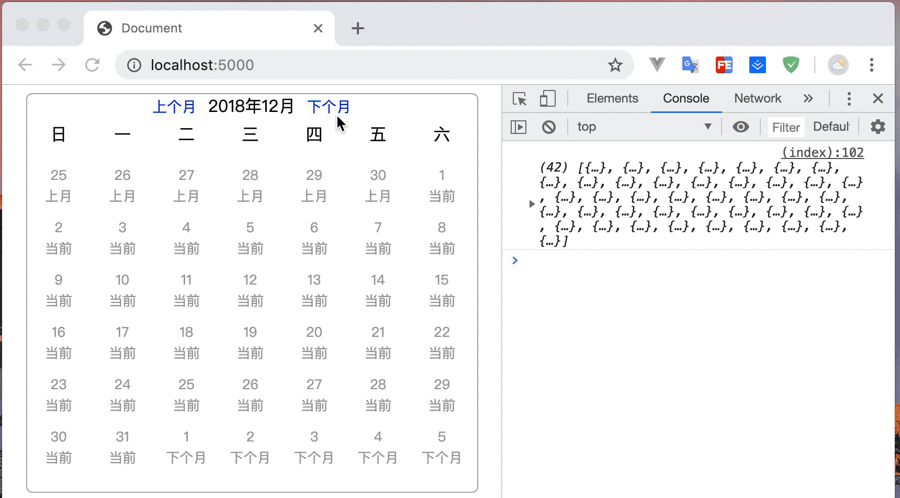

# Calendar（4KB）

 只负责生成日历json数据的工具

### 使用与功能

```sh
 npm i @haoxh/calendar
```

or

```sh
 yarn add @haoxh/calendar
```

基本使用

```js
const opt = {
    prev: '上个月',
    current: '当前',
    next: '下个月'
  }
const calendar =  Calendar({
    // 获取的每个日历数据的最小单元
    // 这里可以自定义想要的数据
    meta:function(item){
      console.log('meta',item)
      return opt[item.target]
    },
    // callback 参数为最终的日历josn 数据
    callback: function (calendarJson) {
      console.log(calendarJson)
    }
    // 设置 dateStr 输出格式
}).format("YYYY/MM/DD")
// 执行生成可以绘制日历的数据
// 触发了 Calendar callback
calendar.paint()

```

生成的数据

```js
// 每个日历数据的最小单元
{
    // 是否上个月 prev， 当前月 current，下个月 next
    "target": "prev",
    // 这天周几
    "week": 0,
    // 是否为今天
    "isToday": false,
    // meta 函数返回的数据
    "meta":'上个月',
    // 这天的 Date 数据
    "date": Date,
    "dateStr": "2018/11/30",
    "year": 2018,
    "month": 11,
    "day": 30
  }
```

### 其他API

```js
// 初始化
calendar.init().paint()
// 上一个月
calendar.prev().paint()
//下个月
calendar.next().paint()
// 去那年那月
calendar.toDate({year,month}).paint()

```

例子

```js
import  Calendar from '@haoxh/Calendar.min'
  const opt = {
    prev: '上个月',
    current: '当前',
    next: '下个月'
  }
  const calendar = Calendar({
    meta: function (data) {
      return opt[data.target]
    },
    callback: function (calendarJson) {
      let html = calendarJson.map(i => `<li>${i.day}<span>${i.meta}</span></li>`)
      document.querySelector('#date').innerText = `${calendar.year()}年${calendar.month()}月`
      document.querySelector('#calendar_content').innerHTML = html.join('')
    }
  })
  // 触发 meta callback
  calendar.paint()
  
  // 上个月
  function prev() {
    calendar.prev().paint()
  }

  // 下个月
  function next() {
    calendar.next().paint()
  }

```


